# EllieSoft
Part of an enormous collection of iOS apps, written in _Phonegap_ (aka _Cordova_).

## Background

  
PhoneGap

_PhoneGap_ was the framework which became _Cordova_ after it was acquired by _Adobe_.  This is essentially a
web page (_NSWebView_ on _iOS_) running locally.  _PhoneGap_ provides additional functionality to access
hardware on the host platform eg camera, pictures, contacts, but none of these apps needed that.

The main attraction of _PhoneGap_ is that it provides a reasonable way to develop cross-platform apps.
The downside is that not all native functionality is available or accessible.  Further, any UI is
constrained by what is available in a web page.  However, for the types of apps I was developing at the time, 
this was an acceptable compromise.

These were written c2008-c2011 and probably do not show the best practices for Javascript as I was just
learning Javascript and fumbling my way through.  However, in my defence,  "Shipping code trumps everything"!

## Apps

### Guess That Car 
_**Please note that the images are deliberately low quality to reduce the size of the repository**_

Are you a petrol head?  Do you know a Ford from a Chrysler?  How well do you know your cars?  Could you identify a car from a picture fragment?

Now you can test your knowledge with this great app. Scratch away to reveal part of a car and then take your best guess. Get it right and earn points to gain access to beautiful galleries of high quality images. Progress through the levels and view over 2000 car pictures.

'Guess That Car' features:
* simple, uncluttered, intuitive interface
* over 2000 high quality, high resolution color images
* beautiful CoverFlow interface to browse galleries
* lots of current cars
* really test your knowledge against:
** car interiors
** concept cars
** high end exotica exotica
* car sound effects (which you can turn off!)

  
Screenshots

  
  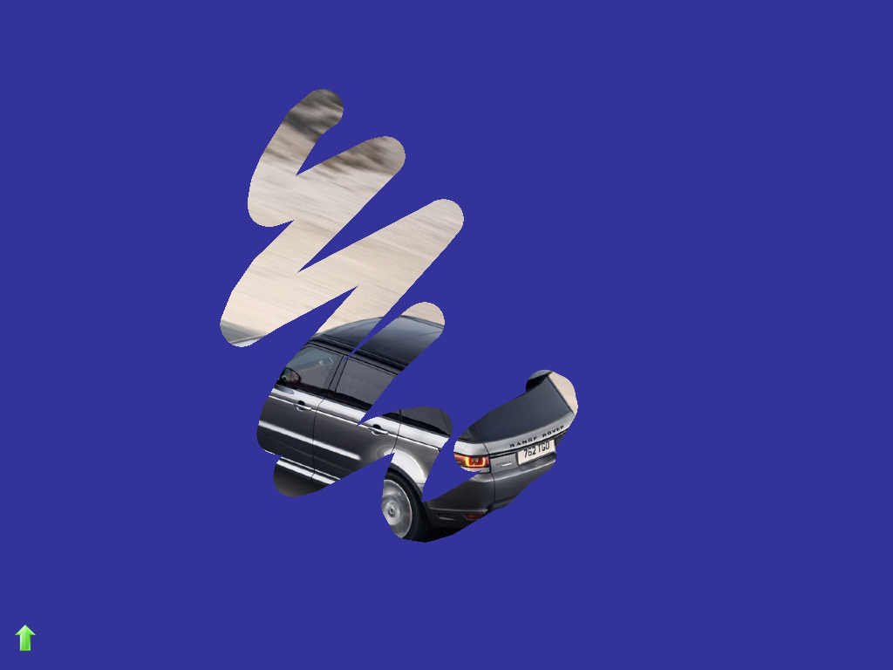

  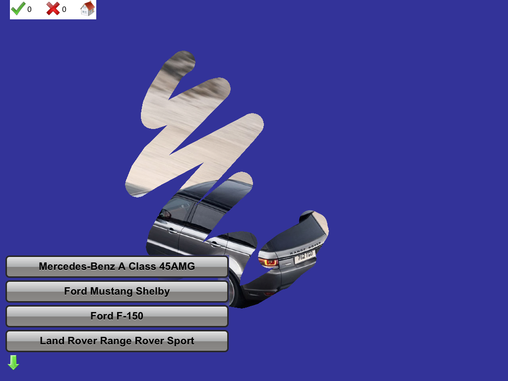

  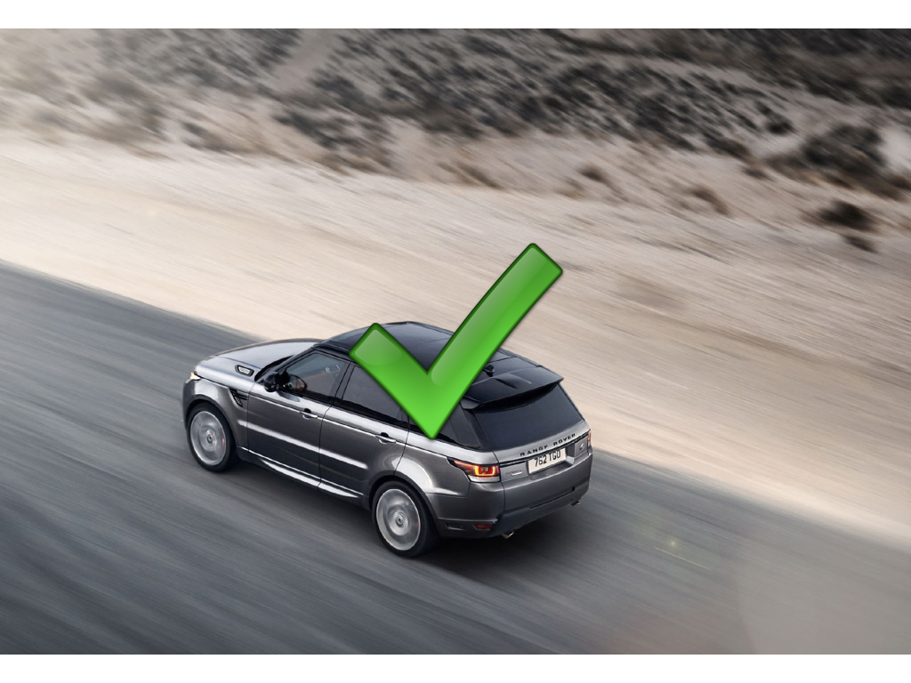

  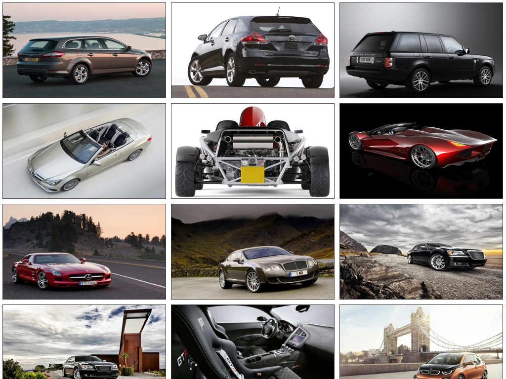

  

  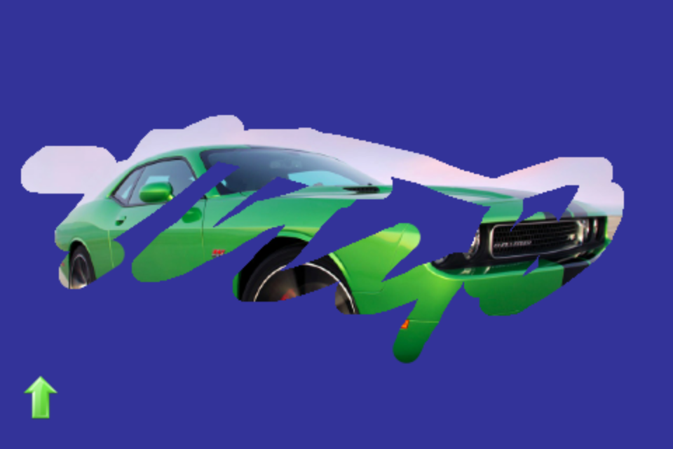

  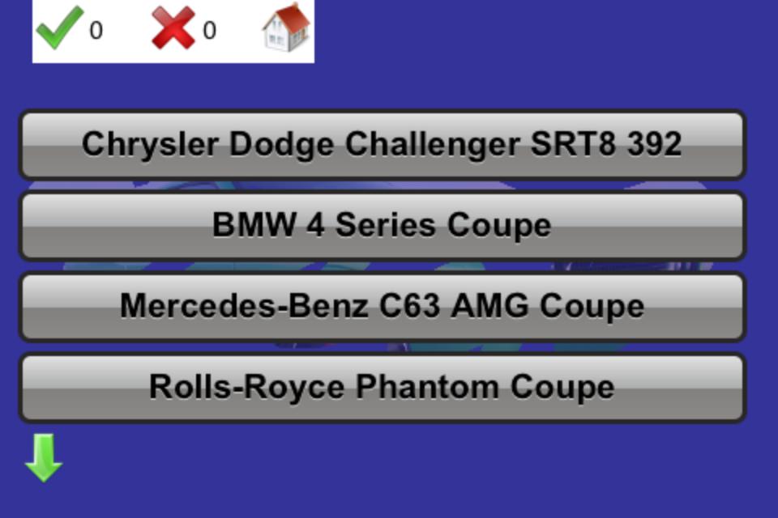

  

  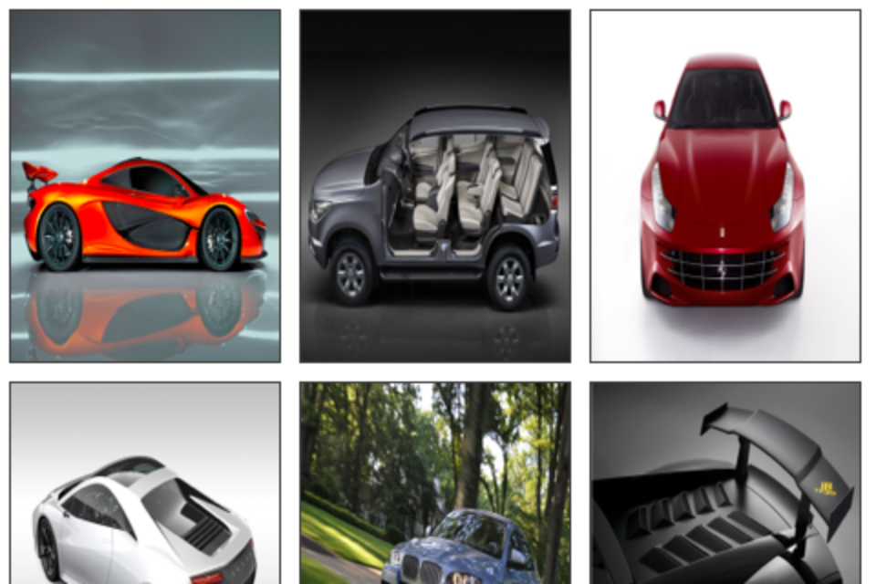

  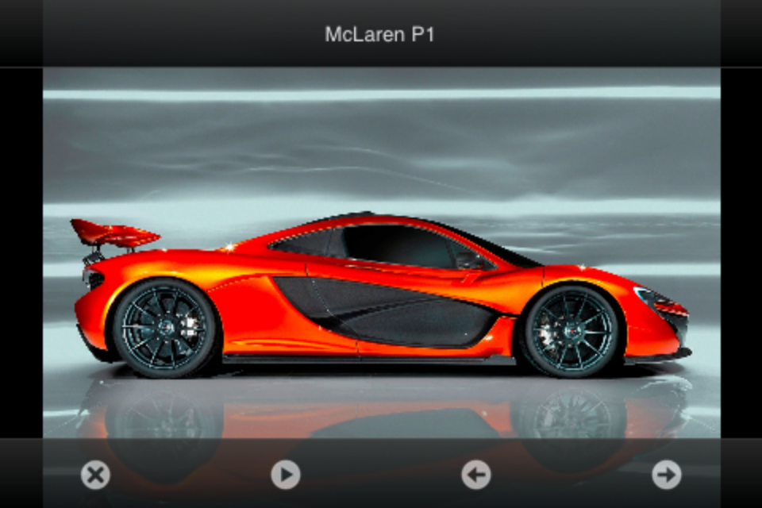

  

  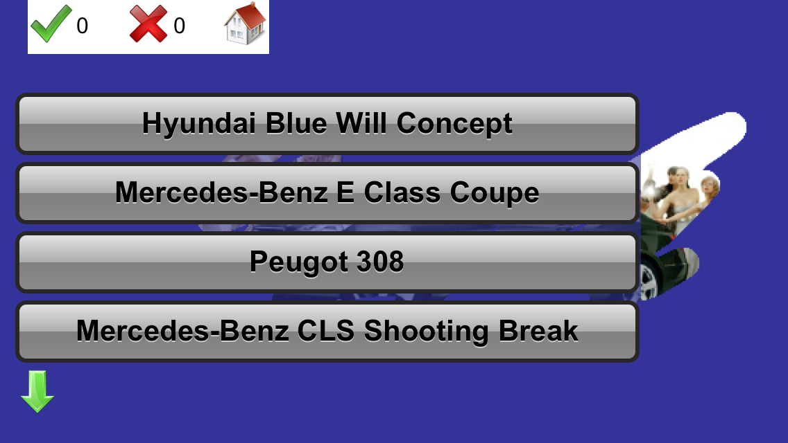

  

  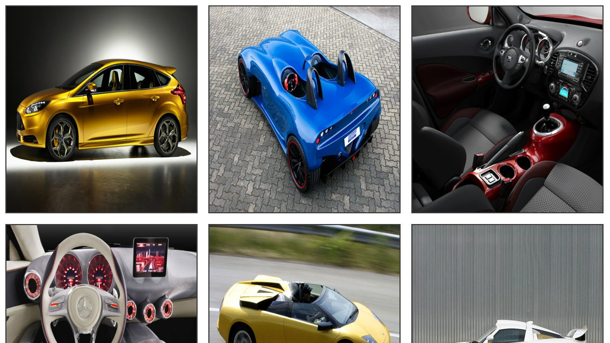

  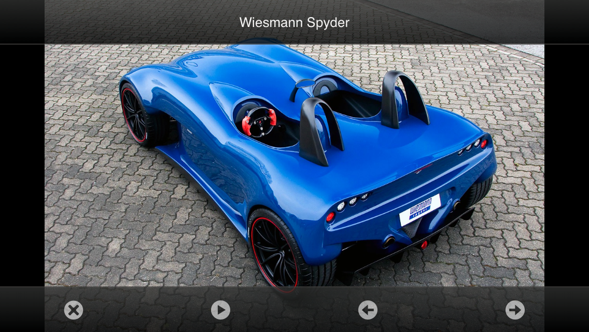

    

